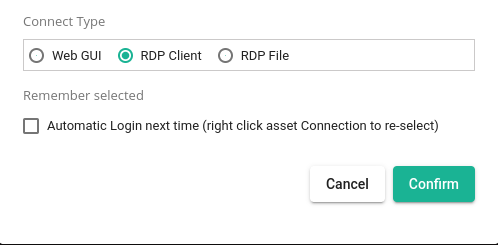
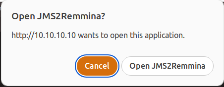

# JMS 2 Remmina

Redirect [JumpServer](https://github.com/jumpserver/jumpserver)   **jms://** URI to [remmina](https://gitlab.com/Remmina/Remmina) client.

There is no linux rdp client for jumpserver, so this application provide workaround:

* step 01: parse client information from '**jms://**' URI;

* step 02: compose temp '.remmina' config from usr, host info;

* step 03: invoke 'remmina' to setup rdp connection to remote host.


You may also refer to official JumpServer client.

https://github.com/jumpserver/clients


# Demo


Select 'Connect Type' to **RDP Client** before click **Confirm**.



Click **Open JMS2Remmina** to invoke 'remmina' to setup rdp connection to remote host.




# Settings

About how to change default behavior of remmina, just edit following templete.

 `/usr/share/jms2remmina.remmina`

## resolution

Below is the definition of resolution_mode used by remmina.

``` c
typedef enum {
    RES_INVALID         = -1, 
    RES_USE_CUSTOM          = 0,
    RES_USE_CLIENT          = 1,
    RES_USE_INITIAL_WINDOW_SIZE = 2 
} RemminaProtocolWidgetResolutionMode;
```

| resolution_mode | Meaning                                                      |
| --------------- | ------------------------------------------------------------ |
| 0               | you have to setup both **resolution_width** & **resolution_height**. |
| 1               | use the same resolution as client.                           |
| 2               | default value, which may mean a very limited scope.          |


# Limitation

password is not presented in URI, so you may need to re-type password in login session window.


# How to build

Just follow below debuild method

```shell
# install dependence
sudo apt install -y libstring-shellquote-perl libgit-wrapper-perl build-essential devscripts debhelper quilt pkg-kde-tools dh-python python3 remmina

# clone code to path/to/your/remmina
cd path/to/your/remmina

# gen orig.tar.xz then build '.deb' pkg in parent dir
git-deborig HEAD --force && debuild -uc -us

# install & enjoy
sudo dpkg -i  ../jms2remmina_1.0-1_amd64.deb
```
